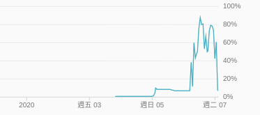

# De novo assembly of the Aedes aegypti genome using Hi-C yields chromosome-length scaffolds (Paper Reproduction)
### Members
* Yang Ming Hang 楊明翰, 108753203
* 曾偉綱, 108753122
* Armando王神鐸, 107753048

### Demo 
example of running human analysis pipline
```R
sudo sh run_Human_script.sh
```

## Folder organization and its related information

### docs
* [1081_bioinformatics_FP_group4.pdf](./docs/1081_bioinformatics_FP_group4.pdf)
* [1081_bioinformatics_FP_group4.pptx](./docs/1081_bioinformatics_FP_group4.pptx)

### data used
* AaegL2
    * [GSE95797_AaegL2.mnd.txt.gz](https://www.ncbi.nlm.nih.gov/geo/query/acc.cgi?acc=GSE95797)
    * [GSE95797_AaegL4.fasta.gz](https://www.ncbi.nlm.nih.gov/geo/query/acc.cgi?acc=GSE95797)
* Human
    * [GSE95797_Hs1.mnd.txt.gz](https://www.ncbi.nlm.nih.gov/geo/query/acc.cgi?acc=GSE95797)
    * [GSE95797_Hs1.fasta.gz](https://www.ncbi.nlm.nih.gov/geo/query/acc.cgi?acc=GSE95797)

You can download the dataset from the helping [shell scripts](./code/download_data).

### code
* Using [3D-DNA](https://github.com/theaidenlab/3d-dna)
  * original packages in the paper

### results

The following figure of Human Hi-C map is the before(right) /after (left) of using 3D-DNA 
to the assembly from draft to chromosome-length scaffolds.


## References
* [https://github.com/theaidenlab/3d-dna](https://github.com/theaidenlab/3d-dna)
* [Dudchenko, O., et al. De novo assembly of the Aedes aegypti genome using Hi-C yields chromosome-length scaffolds. Science. Apr 7; 356(6333):92-95 (2017).](https://www.ncbi.nlm.nih.gov/pubmed/28336562)

## Compute Device Using

* [Google Cloud Platform](https://console.cloud.google.com/)

    * n1-standard-16 (16 vCPUs, 60 GB memory, 1TB HDD)

* OS Version

    * [Ubuntu 16.04.6 LTS (Xenial Xerus)](http://releases.ubuntu.com/16.04/)

* Run both AaegL2&Human

* CPU Usage Plot ( The analysis process run 5 Days)

