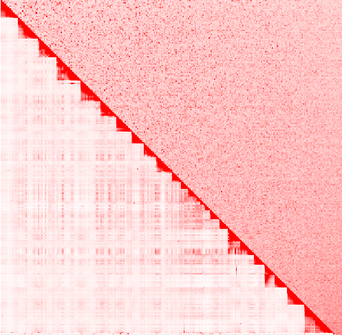

# De novo assembly of the Aedes aegypti genome using Hi-C yields chromosome-length scaffolds (Paper Reproduction)
### Members
* name, student ID1
* name, student ID2
* name, student ID3
* ...

### Demo 
You might provide an example commend or few commends to reproduce your analysis
```R
Rscript code/your_script.R --input data/training --output results/performance.tsv
```

## Folder organization and its related information

### docs
* Your presentation, 1081_bioinformatics_FP_< groupID >.ppt/pptx/pdf, by **01.07**
* Any related document for the paper
  * software user guide

### data
* Source
* Format
* Size

### code
* Which packages do you use? 
  * original packages in the paper
  * additional packages you found
* Analysis steps

### results

The following figure of Human Hi-C map is the before(right) /after (left) of using 3D-DNA 
to the assembly from draft to chromosome-length scaffolds.



## References
* Packages you use
* Related publications


