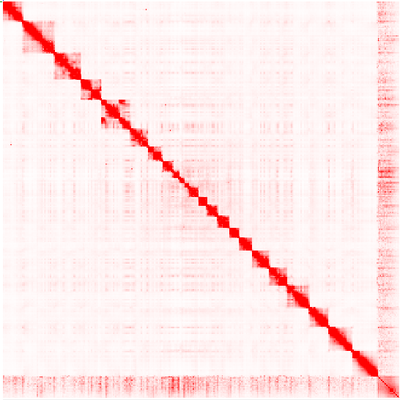

# The output Hi-C map at each stages.

The following figure are plot by [Juicebox](https://github.com/aidenlab/Juicebox)

## AaegL2

- AaegL2.2.0.hic

- AaegL2.2.1.hic

- AaegL2.2.2.hic

## Human

### The Data of this paper

- GSE95797_Hs1.draft.hic

- GSE95797_Hs1.0.hic

- GSE95797_Hs1.1.hic

- GSE95797_Hs1.2.hic

### Other example of human HiC map.

- GM12878_Cell_2014

